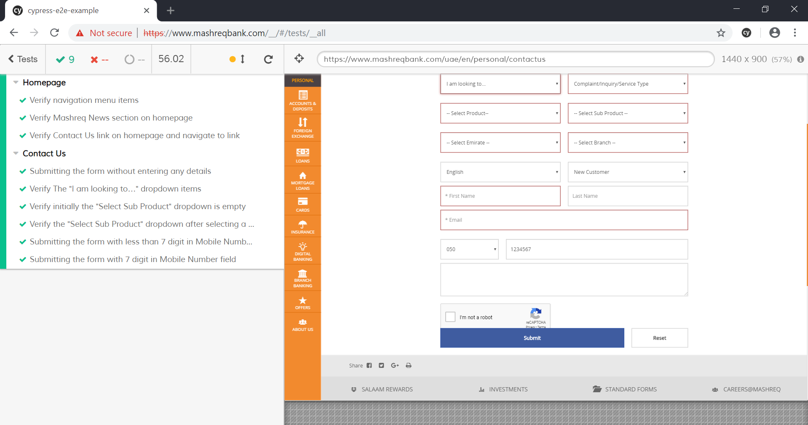
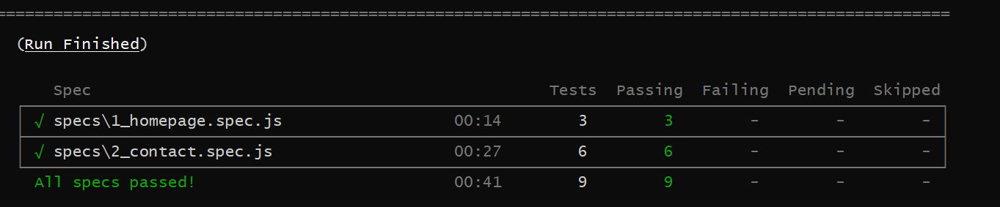

# E2E testing with Cypress

This is an example for e2e tests with Cypress.

## Installation
Install all the dependencies

`npm install`

### Running tests
You have essentially 2 options: 

Run the e2e tests in headless mode or in GUI mode. 

Headless mode opens a browser behind the scenes
and outputs the results in the terminal.

GUI mode opens the nice Cypress GUI and is more suited while developing e2e tests.

Each can run their own webpack dev server or use the one that is already started by you.

#### GUI Mode
`npm run test:runner` - this starts the Cypress test runner

#### Headless mode
`npm run test` - this starts e2e tests in headless without video

`npm run test:record` - this starts e2e tests in headless with video recording

*Recorded videos* - ./cypress/videos

### Coverage
- Home page
- Contact us page

### Prequisites
- Node.js should be installed

**Author:** Abhishek Yadav
